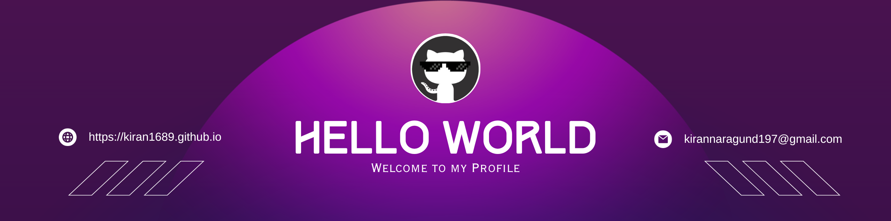

# ɪ'ᴍ ᴋɪʀᴀɴ!
  

                    
*Digital Craftsman (Developer / Programmer)*

                    

Passionate about holistic solutions addressing complex challenges, I develop sustainable systems that make a positive impact through end-to-end product development.

  
  

---
 

                    

<h2 align="center">Languages and Tools</h2> 

 

<h2 align="center">Github Stats and Trophies</h2>

<table width="100%">
  <tr>
    <td width="50%">
      <h3 align="center"><strong>GitHub Stats</strong></h3>
      

        
      

      

        
      

    </td>
    <td width="50%">
      <h3 align="center"><strong>Streak Stats</strong></h3>
      

        
      

      

        
      

    </td>
  </tr>

  <tr>
    <td width="50%">
      <h3 align="center"><strong>My Latest Project</strong></h3>
      

        
      

      

        
      

    </td>
    <td width="50%">
      <h3 align="center"><strong>Top Contributions</strong></h3>
      

        
      

      

        
      

    </td>
  </tr>
</table>

    

 
 

  

---

    

<!--STARTS_HERE_QUOTE_CARD-->

    

<!--ENDS_HERE_QUOTE_CARD-->

    

<h2 align="center">Connect With Me</h2>

 
  
 

  

